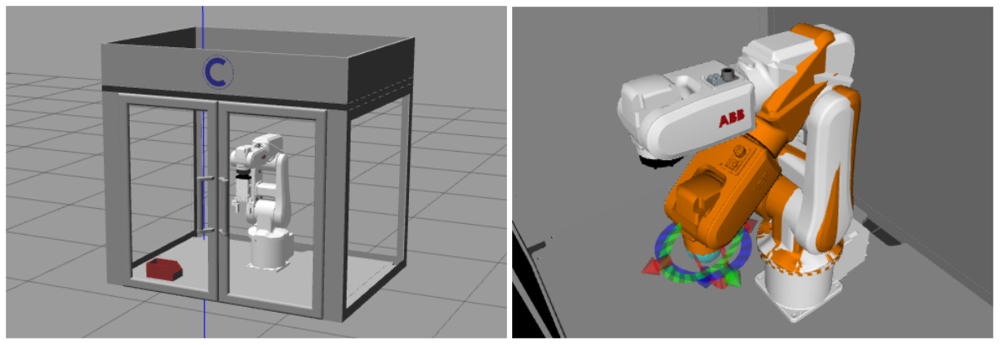

<!-- 
# ===================================== COPYRIGHT ===================================== #
#                                                                                       #
#  IFRA (Intelligent Flexible Robotics and Assembly) Group, CRANFIELD UNIVERSITY        #
#  Created on behalf of the IFRA Group at Cranfield University, United Kingdom          #
#  E-mail: IFRA@cranfield.ac.uk                                                         #
#                                                                                       #
#  Licensed under the Apache-2.0 License.                                               #
#  You may not use this file except in compliance with the License.                     #
#  You may obtain a copy of the License at: http://www.apache.org/licenses/LICENSE-2.0  #
#                                                                                       #
#  Unless required by applicable law or agreed to in writing, software distributed      #
#  under the License is distributed on an "as-is" basis, without warranties or          #
#  conditions of any kind, either express or implied. See the License for the specific  #
#  language governing permissions and limitations under the License.                    #
#                                                                                       #
#  IFRA Group - Cranfield University                                                    #
#  AUTHORS: Mikel Bueno Viso - Mikel.Bueno-Viso@cranfield.ac.uk                         #
#           Dr. Seemal Asif  - s.asif@cranfield.ac.uk                                   #
#           Prof. Phil Webb  - p.f.webb@cranfield.ac.uk                                 #
#                                                                                       #
#  Date: April, 2025.                                                                   #
#                                                                                       #
# ===================================== COPYRIGHT ===================================== #

# ======= CITE OUR WORK ======= #
# You can cite our work with the following statements:
# IFRA-Cranfield (2023) ROS 2 Sim-to-Real Robot Control. URL: https://github.com/IFRA-Cranfield/ros2_SimRealRobotControl.
# IFRA-Cranfield (2025) ROS 2 Sim-to-Real Robot Control. ABB IRB-120 Robot. URL: https://github.com/IFRA-Cranfield/irb120_CranfieldRobotics.

-->

<!--

  README.md TEMPLATE obtined from:
      https://github.com/othneildrew/Best-README-Template
      AUTHOR: OTHNEIL DREW 

-->

<!-- HEADER -->
 

  

   

  <h2 align="center">ROS 2: Sim-to-Real Robot Control - ABB IRB-120 Robot</h2>

  

    IFRA (Intelligent Flexible Robotics and Assembly) Group
     
    Centre for Robotics and Assembly
     
    Cranfield University
  

<!-- TABLE OF CONTENTS -->

  
Table of Contents

  <ol>
    <li>
      <a href="#about">About</a>
      <ul>
        <li><a href="#intelligent-flexible-robotics-and-assembly-group">IFRA-Cranfield Research Group</a></li>
        <li><a href="#irb120_cranfieldrobotics-repository">irb120_CranfieldRobotics Repository</a></li>
      </ul>
    </li>
    <li>
      <a href="#documentation">Documentation</a>
    </li>
    <li><a href="#license">License</a></li>
    <li><a href="#cite-our-work">Cite our work</a></li>
    <li><a href="#contact">Contact</a></li>
    <li><a href="#acknowledgments">Acknowledgments</a></li>
  </ol>

 

<!-- ABOUT THE PROJECT -->
## About

### Intelligent Flexible Robotics and Assembly Group

The IFRA (Intelligent Flexible Robotics and Assembly) Group is part of the Centre for Robotics and Assembly at Cranfield University.

IFRA Group pushes technical boundaries. At IFRA we provide high tech automation & assembly solutions, and we support smart manufacturing with Smart Industry technologies and solutions. Flexible Manufacturing Systems (FMS) are a clear example. They can improve overall operations and throughput quality by adapting to real-time changes and situations, supporting and pushing the transition towards flexible, intelligent and responsive automation, which we continuously seek and support.

The IFRA Group undertakes innovative research to design, create and improve Intelligent, Responsive and Flexible automation & assembly solutions, and this series of GitHub repositories provide background information and resources of how these developments are supported.

__SOCIAL MEDIA__:

IFRA-Cranfield:
- YouTube: https://www.youtube.com/@IFRACranfield
- LinkedIn: https://www.linkedin.com/in/ifra-cranfield/

Centre for Robotics and Assembly:
- Instagram: https://www.instagram.com/cranfieldrobotics/
- Facebook: https://www.facebook.com/cranfieldunirobotics/
- YouTube: https://www.youtube.com/@CranfieldRobotics
- LinkedIn: https://www.linkedin.com/company/cranfieldrobotics/
- Website: https://www.cranfield.ac.uk/centres/centre-for-robotics-and-assembly 

### irb120_CranfieldRobotics Repository

The irb120_CranfieldRobotics repository contains a set of ROS 2 packages developed for the simulation and control of the ABB IRB-120 robotic arm used at the Intelligent Automation Lab, Cranfield University. It provides a complete environment for operating the IRB120 in both simulation and real-world settings, including multiple use cases that demonstrate task execution. The repository also includes structured documentation to guide users through setup, control, and task execution processes, making it a valuable resource for research, teaching, and experimentation in robotics and intelligent automation.

(<a href="#top">back to top</a>)

<!-- DOCUMENTATION -->
## Documentation

For detailed information on installation, usage, and requirements, please refer to the following documentation files available in this repository:

- [Installation.md](https://github.com/IFRA-Cranfield/irb120_CranfieldRobotics/tree/humble/instructions/Installation.md): Instructions for setting up and installing the required dependencies.
- [Examples.md](https://github.com/IFRA-Cranfield/irb120_CranfieldRobotics/tree/humble/instructions/Examples.md): Guidelines for launching the ros2srrc-based ROS 2 Robot Simulation and Control environment for our IRB120 Robot at Cranfield.

(<a href="#top">back to top</a>)

<!-- LICENSE -->
## License

  Intelligent Flexible Robotics and Assembly Group
   
  Created on behalf of the IFRA Group at Cranfield University, United Kingdom
   
  E-mail: IFRA@cranfield.ac.uk 
   
   
  Licensed under the Apache-2.0 License.
   
  You may obtain a copy of the License at: http://www.apache.org/licenses/LICENSE-2.0
   
   
  <a href="https://www.cranfield.ac.uk/">Cranfield University</a>
   
  Faculty of Engineering and Applied Sciences (FEAS)
   
    <a href="https://www.cranfield.ac.uk/centres/centre-for-robotics-and-assembly">Centre for Robotics and Assembly</a>
   
  College Road, Cranfield
   
  MK43 0AL, Bedfordshire, UK
   

(<a href="#top">back to top</a>)

<!-- CITE OUR WORK -->
## Cite our work

  You can cite our work with the following statements:
   
  IFRA-Cranfield (2023) ROS 2 Sim-to-Real Robot Control. URL: https://github.com/IFRA-Cranfield/ros2_SimRealRobotControl.
   
  IFRA-Cranfield (2025) ROS 2 Sim-to-Real Robot Control. ABB IRB-120 Robot. URL: https://github.com/IFRA-Cranfield/irb120_CranfieldRobotics.

(<a href="#top">back to top</a>)

<!-- CONTACT -->
## Contact

  Mikel Bueno Viso - Research Assistant in Intelligent Automation at Cranfield University
   
  E-mail: Mikel.Bueno-Viso@cranfield.ac.uk
   
  LinkedIn: https://www.linkedin.com/in/mikel-bueno-viso/
   
  Profile: https://www.cranfield.ac.uk/people/mikel-bueno-viso-32884399
   
   
  Dr. Seemal Asif - Lecturer in Artificial Intelligence and Robotics at Cranfield University
   
  E-mail: s.asif@cranfield.ac.uk
   
  LinkedIn: https://www.linkedin.com/in/dr-seemal-asif-ceng-fhea-miet-9370515a/
   
  Profile: https://www.cranfield.ac.uk/people/dr-seemal-asif-695915
   
   
  Professor Phil Webb - Professor of Aero-Structure Design and Assembly at Cranfield University
   
  E-mail: p.f.webb@cranfield.ac.uk
   
  LinkedIn: https://www.linkedin.com/in/phil-webb-64283223/
   
  Profile: https://www.cranfield.ac.uk/people/professor-phil-webb-746415 
   

(<a href="#top">back to top</a>)

<!-- ACKNOWLEDGMENTS -->
## Acknowledgments

* [README.md template - Othneil Drew](https://github.com/othneildrew/Best-README-Template).
* [ROS 2 Documentation - Humble](https://docs.ros.org/en/humble/index.html).

(<a href="#top">back to top</a>)
